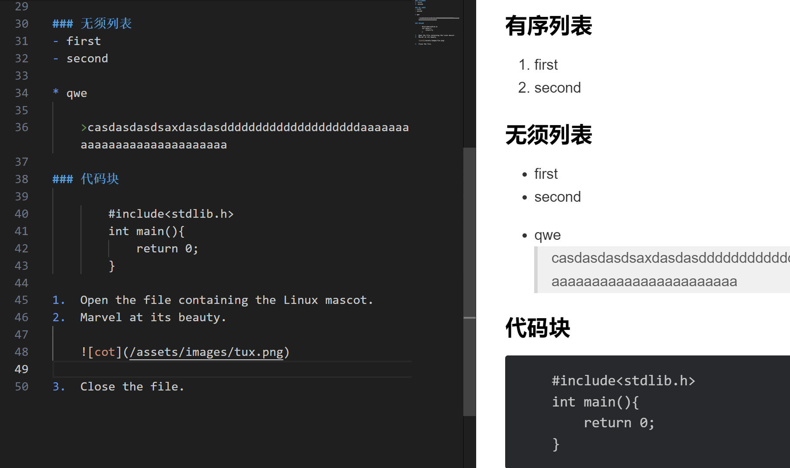

# 一
## 12
I really like using Markdown.

I think I'll use it to format all of my documents from now on.
## 强调语法

### 粗体
我是**陈亚鹏**

### 斜体
我是*陈亚鹏*

### 粗斜体
我是***陈亚鹏***

## 块引用
> include
> include
>
> include
>> include

## 列表

### 有序列表
1. first
2. second

### 无须列表
- first
- second

* qwe

    >casdasdasdsaxdasdasddddddddddddddddddddaaaaaaaaaaaaaaaaaaaaaaaaaaaa

### 代码块

        #include<stdlib.h>
        int main(){
            return 0;
        }

1.  Open the file containing the Linux mascot.
2.  Marvel at its beauty.
    
3.  Close the file.

## 代码语法
Use `code` in your Markdown file.